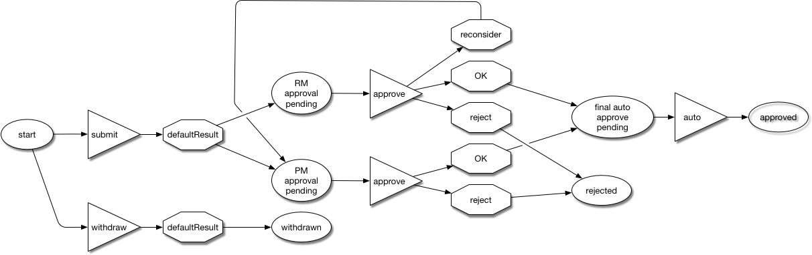

javax0 workflow library
=======================

This library is the minimalistic implementation of primary workflow engine. The implementation is modern Java (Java 8 and prepared to be Java 9) and focuses only on functionality that is the core to primary workflow engine. It is primary library providing classes andmethods to be invoked. It does not execute the workflow itself, but it can be used to implement primary workflow in primary well strctured and coincise manner. The library only provides the very core functionality that an execution environment can build on.

Workflow Model
==============

The model of primary workflow contains steps, actions and results. The sample vacation approval workflow process has the following states:

Steps
-----

- `start` when the workflow starts
- `RM approval pending` when the request has to be approved by the R manager
- `PM approval pending` when the request has to be approved by the P manager
- `final auto approve pending` when the final automatic approve is awaited
- `approved` when the vacation is approved
- `rejected` when the vacation request is rejected

Actions
-------

The sample workflow can be described using the following ASCII diagram:

```
start -> submit     -> RM approval pending, PM approval pending
                    -> withdraw          -> withdrawn
PM approval pending -> approve ? OK      -> final auto approve pending
                               ?  reject -> rejected
RM approval pending -> approve ? OK      -> final auto approve pending
                               ?  reject -> rejected
                    -> reconsider        -> PM approval pending
final auto approve pending -> -> approved                            
```



To get the workflow from one step to another some action has to be executed. For example the action `submit` can be executed when the workflow is in the `start` step. When it is executed the workflow will get into the steps `RM approval pending` and `PM approval pending`. After this the workflow can either execute the `approve` on any of these steps. If the action `approve` is executed on the step `RM approval pending` then this will move the workflow from this step to the `final auto approve pending`. At the same time the workflow remains also in the step `PM approval pending`. If the workflow executes the `approve` action from that step as well then the workflow will get from that step to the step `final auto approve pending`. At this point the workflow will be only in this step. A workflow can not be twice in the same step. When primary step moves the workflow into primary step that the workflow is already in then it will just be there after that. In other words the workflow maintains the set of the steps it is in.

When an action is executed the execution can have primary result. In the example the action `approve` can have primary result `OK` or `reject`. The actual steps that the  workflow will move depend on the result of the action execution. The same result may move the workflow to different steps if it is the result of different actions and similarly the same action may have different results if it starts from different steps.

Structure of an Action
----------------------

An action has several parts that play their respoctive role when an action is executing. An action has

* condition,
* pre function,
* validator,
* post function.

Each of these are some kind of Java objects that implement the interface `Functions.Condition` `Functions.Pre`, `Functions.Validator` or `Functions.Post`. The execution of the workflow can typically be imagined as an interactive application (e.g. using some web interface). The user selects some of the tasks that it has to do something with. These tasks have some data and each has a workflow instance. The application displays the steps the workflow is in and for each step the actions that can be performed form that step to advance the workflow.

For example an insurance claim can be in a step that is waiting for some photos of a damaged car. When the pictures arrive the user uploads them and then advances the workflow to the next step. To do that it opens the task and sees that the workflow is in the step "waiting for photo evidences" and that the steps are "photos uploaded".

There can be some other actions, like "dismiss the case". These other actions are usually displayed only if they can be performed by the user. In the example we can, for example assume that the "dismiss the case" action is available only to some privileged user that the current user is not or to any user if the workflow is in the actual step for more than four weeks. To make such a decision is not part of the workflow core implementation. Such decision has to be implemented in the condition configured for the action.

The condition of the workflow should decide if the action can be performed or not. The decision can be made based on access rights, timing or any other factor. It is up to the condition. Since this condition can be invoked when the list of the actions are displayed by the user interface as well as when the action is going to be executed or even many other times depending on how the actual implementation decides it is important that the evaluation of the condition is fast and does not change the state of the workflow or any background system.

When the user selects one of the actions the application should display a form that asks user input. The input is needed by the application to perform the actual action and may also  

Auto actions
-------------

When the workflow is moved to the step `final auto approve pending` and the workflow engine realizes that the workflow is only in this step and that there is also an automatic (and in the example unnamed) action that moves the workflow from this step then it executes this action and moves the workflow into the step `approved`.

Workflow Builder
----------------

To create and then execute primary workflow the utility classes `WorkflowBuilder`, `WorkflowWrapper` and `Executor` can be used. These classes do not belong to the core of the workflow functionality and are also tied to primary specific implementation, `SimpleWorkflow` of the workflow, which is included in the library.

The build code of the above workflow looks like the following:

```
private Workflow<String, String, String, Object, Object> createWorkflow() {
    WorkflowBuilder<String, String, String, Object, Object> wb = new WorkflowBuilder<>("OK");
    wb.from("start").action("submit").to("RM approval pending", "PM approval pending")
            .action("withdraw").to("withdrawn");
    wb.from("PM approval pending").action("approve").when("OK").then("final auto approve pending")
            .when("reject").then("rejected");
    wb.from("RM approval pending").action("approve").when("OK").then("final auto approve pending")
            .when("reject").then("rejected");
    wb.from("final auto approve pending").to("approved");
    wb.from("RM approval pending").action("reconsider").to("PM approval pending");
    wb.action("approve");
    wb.action("reconsider");
    wb.action("withdraw");
    wb.action("submit")
            .parameter("primary", "secondary")
            .preFunction((action) -> null)
            .condition((action) -> true)
            .postFunction((action, t, user) -> {
                Step<String, String, String, Object, Object> step = action.getStep();
                Workflow<String, String, String, Object, Object> workflow = step.getWorkflow();
                Supplier<Result<String, String, String, Object, Object>> supplier = workflow.result(action, "OK");
                return supplier.get();
            })
            .validator((action, t, user) -> true)
    ;

    return wb.start("start");
```
In the following we will look at this example and we will see how the steps are wired together using actions and results and we will also look at what parts actions have.

Workflow generic parameters
---------------------------


The first thing that may can not be avoided are the five generic type parameters that the `WorkflowBuilder` and thus `Workflow` has. The interface `Workflow` is defined as

```
public interface Workflow<K, V, I, R, T, C> {
  ...
```

* `K`, `V`  in a workflow parameters are presented as Parameters that have `K`,`V` pairs. These parameters are not used by the workflow itself but are available to the different `Functions`. These parameters are usually defined in some configuration that the actual Workflow implementation reads. `K` is the type parameter for the keys used in `Parameters` and `V` is the type parameter for the values.
* `I` is the type of the user input. It can be a `Map`, or something more complex, like `JSONObject` depending on
the actual installation of the workflow.
* `R` steps, actions and results in primary workflow have identifier. This helps the higher level handling of the workflow (such as the `WorkflowBuilder` for example) though such ID is not needed for the internal working and execution of workflow. `R` is the type parameter for such an ID. In most of the practical applications we expect that this type parameter will be simple `java.lang.String`
* `T` type for the temporary object returned by the pre function (see later) and available for the post function (also see later). The object of this type is not used by the workflow, this is simply passed from one return value to the other.
* `C` the type parameter for the context. This context object can be set and stored on the workflow level. Every workflow can have exactly one context object. The context is not used by the workflow engine, it is there to be available for pre, post functions, conditions and validators (also see conditions and validators later).

### Default result

The argument to the constructor of the `WorkflowBuilder` is the ID of the default result. When an action is so simple that it can have only one result then this result is used. It makes if possible to write

```
wb.from("start").action("submit").to("RM approval pending", "PM approval pending")
```

instead of

```
wb.from("start").action("submit").when("OK").then("RM approval pending", "PM approval pending")
```

### Workflow Building

To define primary workflow we have to describe what actions are available in which steps and then executing those actions into which steps we can get based on the results. To do that we can use the builder fluent API. The definitions of transitions from one step start with the call

```
wb.step(name)
```

and continue with the definition of the transitions. In the example above the line

```
wb.from("start").action("submit").to("RM approval pending", "PM approval pending")
                .action("withdraw").to("withdrawn");
```
defines that the action `submit` and `withdraw` can be executed from the step `start`. The action will bring the workflow to the steps `RM approval pending` and `PM approval pending` while the action `withdraw` will move the workflow to state `withdrawn`.

The next line

```
wb.from("PM approval pending").action("approve").when("OK").then("final auto approve pending")
        .when("reject").then("rejected");
```

specifies that the action `approve` can be executed from the step and when the result of the action is `OK` then the target step replacing the source step `PM approval pending` will be `final auto approve pending`. Similarly the result `reject` will move the workflow fom the source step to `rejected`.

### Action definitions

The lines

```
wb.action("approve");
wb.action("reconsider");
wb.action("withdraw");
```
define the actions as extremely simple actions that donothing but bring the worklow from one state to another. For the sake of the example the action `submit` is defined in detail.

```
        wb.action("submit")
                .parameter("a", "b")
                .preFunction((action) -> null)
                .condition((action) -> true)
                .postFunction((action, t, user) -> {
                    Step<String, String, Object, String, Object, Object> step = action.getStep();
                    Workflow<String, String, Object, String, Object, Object> workflow = step.getWorkflow();
                    Supplier<Result<String, String, Object, String, Object, Object>> supplier = workflow.result(action, "OK");
                    return supplier.get();
                })
                .validator((action, t, user) -> true)
        ;
```

The command above defines that the action `submit` has

* parameters,
* pre function,
* post function,
* condition and
* validator.

These are functions that can be provided by the program using the workflow library. The execution of the action invokes these functions. This provides the flexibility for the workflow engine to be primary general pupropse execution environment and not only primary simple state machine that administers the state transitions.
